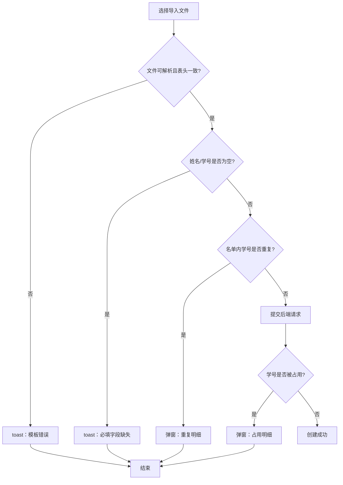

# 1.0.8 优化需求

## 0. 文档修订记录


| 版本号    | 修改日期       | 修改人   | 修改内容               |
| ------ | ---------- | ----- | ------------------ |
| V1.0.8 | 2026-06-10 | Arlen | 新增“创建班级导入学生异常处理优化” |


## 1. 班级禁用后业务数据过滤

### 背景

班级管理支持禁用/启用班级。班级被禁用后，在业务中仍会显示该班级（保留历史数据），但需在各业务入口过滤掉已禁用班级，不纳入统计与操作。

### 涉及模块


| 模块   | 具体位置                      | 处理方式    |
| ---- | ------------------------- | ------- |
| 首页   | 各板块数据统计、班级选择器             | 过滤已禁用班级 |
| 智能授课 | 进入课堂的班级选择窗口               | 过滤已禁用班级 |
| 点名   | 班级选择器（所有调用点名的地方）          | 过滤已禁用班级 |
| 课堂点评 | 班级选择器（上课点评弹窗、智能评测-课堂点评页面） | 过滤已禁用班级 |
| 作业批改 | 班级选择器（日常作业列表、各类作业布置界面）    | 过滤已禁用班级 |
| 学生管理 | 班级选择器                     | 过滤已禁用班级 |
| 综合评价 | 班级选择器                     | 过滤已禁用班级 |
| 学情分析 | 班级选择器                     | 过滤已禁用班级 |
| 智能批改 | 班级选择器（批改列表、创建智能批改界面）      | 过滤已禁用班级 |
| 个人中心 | 任教班级列表                    | 过滤已禁用班级 |


## 2. 校本资源可见范围与信息展示优化

### 背景

智能备课中，教师可将章节下的备课资源"共享"到校本资源，供其他用户查看，但自己也需要能看到。

### 改动点


| #   | 位置     | 当前状态                         | 期望改动                               |
| --- | ------ | ---------------------------- | ---------------------------------- |
| 1   | 校本资源列表 | 仅显示他人共享的资源，看不到自己共享的          | 显示全部校本资源（含自己共享的）                   |
| 2   | 资源卡片   | 无共享人姓名                       | 显示共享人姓名                            |
| 3   | 资源卡片   | 显示精确时间 `2026-05-22 17:36:49` | 仅显示日期 `2026-05-22`（去掉时分秒，腾出空间显示姓名） |
| 4   | 资源卡片   | 所有资源均有"采纳"按钮                 | 自己共享的资源不显示"采纳"按钮（采纳自己的资源无意义）       |


## 3. 教师管理-编辑账号手机号重复提示优化

### 背景

编辑老师账号时，若填写的手机号已被其他老师占用，后端返回原始错误信息，前端直接展示导致用户体验差。

### 改动点


| #   | 场景               | 当前状态                                | 期望改动                        |
| --- | ---------------- | ----------------------------------- | --------------------------- |
| 1   | 教师管理-编辑账号，手机号被占用 | 弹出原始错误信息 `"提交失败：PBNetException..."` | 提示"手机号已存在，请更换后重试"，与新增账号保持一致 |


### 说明

新增账号时手机号重复已有正确提示"手机号已存在，请更换后重试"，编辑账号应与此保持一致。后端需补充对应错误码，前端做统一文案展示。

## 4. 学科选择器按老师任教学科过滤

### 背景

系统中多个页面涉及学科选择，但老师只教授固定学科，应在各学科选择器中只展示其任教的学科选项，避免误选。

### 涉及模块


| 模块   | 页面/功能                            | 处理方式       |
| ---- | -------------------------------- | ---------- |
| 智能备课 | 切换教材窗口，学科选择器                     | 仅显示老师任教的学科 |
| 智能授课 | 切换教材窗口，学科选择器                     | 仅显示老师任教的学科 |
| 作业批改 | 作业列表、各类作业布置界面，学科选择器              | 仅显示老师任教的学科 |
| 智能组卷 | 自主组卷库、个人题库、公共题库、精细化组卷、快速组卷，学科选择器 | 仅显示老师任教的学科 |
| 智能助手 | 教学工作计划生成界面，学科选择器                 | 仅显示老师任教的学科 |
| AI讲课 | 选择在线课件窗口，科目选择器                   | 仅显示老师任教的学科 |


## 5. 一键备课扣点功能

### 5.1 背景

一键备课功能通过后端工作流统一执行，前端在页面上勾选资源项后一次性提交，由后端按资源分支完成实际生成。由于前端不再调NPC，现有扣点机制无法直接覆盖一键备课场景，因此需要补充适配工作流模式的统一扣点能力。

### 5.2 目标

1. 前端在用户勾选资源时，实时展示“预计消耗 X 点”；
2. 后端工作流在资源实际执行时，按资源类型执行工作流扣点；
3. 前端展示扣点项和后端工作流扣点数量分别配置，保证口径一致。

### 5.3 扣点时机说明

前端勾选资源时，根据配置的扣点项计算展示预计消耗；后端工作流执行到对应资源分支时，按工作流扣点数量执行实际扣点。最终扣点结果以后端工作流实际执行情况为准。

### 5.4 资源类型范围

一键备课扣点仅支持以下 12 种固定资源类型，资源类型为预置枚举：


| 资源名称 | 资源类型值 |
| ---- | ----- |
| 教案   | 1     |
| 学案   | 2     |
| 课件   | 3     |
| 智能体  | 4     |
| 听写   | 5     |
| 模板活动 | 100   |
| AI活动 | 101   |
| 趣味抽奖 | 102   |
| 单词评测 | 120   |
| 对话评测 | 121   |
| 场景对话 | 122   |
| 随堂测  | 130   |


### 5.5 后台配置说明

后台需提供一键备课扣点映射配置能力，资源类型预置展示，不支持新增、删除。管理员为每个资源类型配置前端展示扣点项，以及后端工作流实际执行时的工作流扣点数量。

#### 配置字段说明


| 字段      | 说明                        |
| ------- | ------------------------- |
| 资源名称    | 固定显示，不可编辑                 |
| 扣点项     | 多选，从已有扣点项中选择，用于前端展示预计消耗点数 |
| 工作流扣点数量 | 正整数，后端工作流执行时实际扣除的点数       |
| 备注      | 可选                        |


#### 配置规则

1. 资源预置：资源类型列表由系统预置，不支持新增、删除或修改类型值
2. 扣点项选择：每个资源类型可配置 0 个或多个扣点项，前端据此计算展示预计消耗
3. 工作流扣点数量：每个资源类型需配置工作流扣点数量，为 0 表示工作流不扣点
4. 配置来源：扣点项从现有扣点项配置中选择，不单独新建

### 5.6 前端一键备课页面

#### 功能说明

前端进入一键备课页面时，需加载资源类型枚举、资源与扣点项映射关系、扣点项对应点数值。用户勾选资源后，页面根据映射关系累加点数，并展示预计消耗；提交时将选中的资源类型列表传递给后端工作流。

#### 计算规则

总点数 = 所选资源类型对应的所有扣点项点数值之和。

#### 交互规则

1. 初始化加载：页面初始化时加载资源枚举、扣点映射及扣点项点数值
2. 勾选计算：用户每次勾选或取消勾选资源时，页面需实时重新计算预计消耗点数
3. 展示文案：页面显式展示“预计消耗 X 点”
4. 提交参数：提交时仅传递用户选中的资源类型列表给后端
5. 口径一致：前端预计消耗基于后台扣点项配置计算，与后端工作流扣点口径分开

### 5.7 业务流程

```text
用户勾选资源
    ↓
前端根据映射查出扣点项，累加点数，展示预计消耗
    ↓
用户提交，后端启动工作流
    ↓
教案分支 → 查教案工作流扣点数量 → 扣点
课件分支 → 查课件工作流扣点数量 → 扣点
AI活动分支 → 查AI活动工作流扣点数量 → 扣点
    ↓
工作流完成，返回结果
```

## 6. 备课页与授课页章节选择联动

### 功能说明

备课页与授课页左侧教材章节选择组件需共享同一份当前教材章节上下文。用户在任一页面切换教材或章节后，另一页面进入时应默认定位到最新一次选择的教材与章节，减少重复选择成本，保持同一节课的操作连续性。

### 同步规则


| #   | 规则项  | 规则说明                               |
| --- | ---- | ---------------------------------- |
| 1   | 共享范围 | 两个页面共享当前教材与当前章节的选中结果               |
| 2   | 同步内容 | 至少包含教材 ID、章节 ID；可按需要缓存教材名称、章节名称    |
| 3   | 写入时机 | 用户在任一页面主动切换教材或章节后，立即更新共享缓存         |
| 4   | 读取时机 | 页面初始化或页面切换进入时，优先读取共享缓存并默认定位到对应教材章节 |
| 5   | 生效口径 | 以用户最近一次主动选择的教材章节为准，另一页面进入时跟随最新结果   |

## 7. ~~学情分析诊断报告生成链路优化~~（已废弃）

### ~~背景~~

~~当前学情分析中生成"诊断报告"后，报告底部有"个性化学案""个性化教案""个性化课件"三个按钮，点击后可分别跳转到对应内容的生成界面。但由于该诊断报告属于临时态页面，用户一旦点击任一按钮跳转，就无法再回到当前这份诊断报告，导致无法基于同一份诊断报告继续生成另外两个内容，影响诊断结果的连续复用。~~

### ~~优化目标~~

~~保持诊断报告底部的三个生成入口不变，用户点击后进入对应生成页面，生成内容保存后自动返回学情分析诊断报告界面，避免因页面跳转丢失诊断报告上下文。~~

### ~~改动点~~

~~1. 通过诊断报告生成内容保存后，应返回当前诊断报告页~~

### ~~交互规则~~

~~1. 入口：诊断报告底部三个按钮正常展示，点击打开对应生成页面~~
~~2. 生成：在对应生成页面完成内容生成并保存~~
~~3. 返回：保存成功后自动关闭生成页面，回到当前诊断报告页~~
~~4. 循环：用户可基于同一份诊断报告，依次生成教案、课件、学案~~


## 8. 创建班级导入学生异常处理优化

### 8.1 背景

当前“创建班级-导入学生”功能在上传与提交阶段存在多类失败场景，但页面提示不明确，用户无法感知具体失败原因，只能看到“班级创建失败”或无任何提示，需优化导入校验链路与错误反馈方式。

### 8.2 当前存在的问题

1. 上传的表格格式与模板不一致时，在上传阶段即失败，当前页面无任何提示，仅控制台报错，用户无法理解失败原因。
2. 上传名单中必填字段缺失（如姓名、学号为空）时，提交后仅 toast 提示“班级创建失败”，未说明具体原因。
3. 上传名单中学号存在表内重复时，提交后仅 toast 提示“班级创建失败”，未说明具体重复数据。
4. 上传名单中学号已被同校其他学生主体占用时，提交后仅 toast 提示“班级创建失败”，未说明具体冲突对象。

### 8.3 优化目标

1. 明确区分上传阶段、前端提交前校验、后端提交后校验三个阶段的处理逻辑。
2. 前端可识别的结构性问题与基础字段问题，应尽量在前端拦截并即时反馈，减少无效提交。
3. 后端对导入数据进行完整校验，返回清晰的错误类型与错误明细，避免统一提示“班级创建失败”。
4. 不同类型错误采用匹配的提示方式：简单阻断类错误用 toast，需定位明细的错误用弹窗展示。

### 8.4 校验分层与执行顺序

#### 前端校验范围

前端在文件上传成功解析后、正式提交前，可完成以下校验：

1. 模板结构校验：文件是否可正常解析、表头是否与模板一致、必需列是否存在。
2. 基础字段校验：姓名、学号是否为空。
3. 表内重复校验：本次上传名单内学号是否重复。

说明：以上三类校验无需依赖服务端数据，前端可直接拦截并反馈，不进入后端创建流程。

#### 后端校验范围

后端在前端校验通过后，继续进行服务端完整校验，至少包含：

1. 学号占用校验：学号是否已被同学校其他学生主体占用。
2. 兜底完整性校验：对前端已做的模板、必填、表内重复规则再次校验，避免因前端绕过、版本不一致等情况导致脏数据入库。

说明：后端返回时需区分错误类型，并返回可用于展示的错误明细。

### 8.5 校验中断规则

1. 校验按顺序执行。
2. 当前一层级校验失败时，不再继续后续层级校验。
3. 同一层级内若存在多条错误，应尽量一次性收集并反馈当前层级全部错误。
4. 第三层“表内学号重复”校验失败后，不再继续后端“学号被其他学生占用”校验。

### 8.6 校验流程图




校验流程按以下顺序执行，详细错误场景与提示方式见下节。

### 8.7 错误场景与提示方式


| #   | 错误场景                    | 校验阶段      | 执行方 | 是否继续后续校验 | 提示方式              | toast提示文案        |
| --- | ----------------------- | --------- | --- | -------- | ----------------- | ---------------- |
| 1   | 上传文件无法解析、表头与模板不一致、缺少必需列 | 上传后解析阶段   | 前端  | 否        | toast             | 导入文件有误，请按模板调整后重试 |
| 2   | 姓名为空                    | 提交前基础字段校验 | 前端  | 否        | toast             | 姓名或学号未填写，请检查后重试  |
| 3   | 学号为空                    | 提交前基础字段校验 | 前端  | 否        | toast             | 姓名或学号未填写，请检查后重试  |
| 4   | 上传名单内学号重复               | 提交前表内重复校验 | 前端  | 否        | 弹窗                | —                |
| 5   | 学号已被同校其他学生主体占用          | 提交后服务端校验  | 后端  | 否        | 弹窗                | —                |
| 6   | 后端兜底发现模板/必填/重复问题        | 提交后服务端校验  | 后端  | 否        | 按错误类型返回 toast 或弹窗 | toast场景复用前端对应文案  |


### 8.8 弹窗明细展示要求

#### 表内学号重复

```text
┌──────────────────────────────────────────────┐
│ 导入失败                                     │
├──────────────────────────────────────────────┤
│ 导入名单中存在重复学号，请修改后重新提交。       │
│                                              │
│ 学号        姓名                              │
│ 20240001    张三                             │
│ 20240001    李四                             │
│ 20240015    王五                             │
│                                              │
│                            [我知道了]         │
└──────────────────────────────────────────────┘
```

#### 学号被占用

```text
┌──────────────────────────────────────────────┐
│ 导入失败                                     │
├──────────────────────────────────────────────┤
│ 以下学号已被本校其他学生占用，请核对后重新提交。  │
│                                              │
│ 学号        姓名                              │
│ 20230008    张三                              │
│ 20230021    李四                              │
│                                              │
│                            [我知道了]         │
└──────────────────────────────────────────────┘
```

### 8.9 接口返回要求

1. 后端需返回明确的错误类型标识，至少区分：模板错误、必填缺失、表内重复、学号占用。
2. 对于需弹窗展示的错误场景，后端需返回错误明细列表，至少包含 学号、姓名。
3. 前端根据错误类型决定使用 toast 或弹窗，不再统一展示“班级创建失败”。
4. 若后端返回未知异常，前端再兜底提示“班级创建失败，请稍后重试”。

