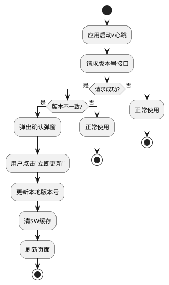

# [V7.0] 产品需求文档

## 0. 文档修订记录

| 版本号 | 修改日期   | 修改人 | 修改内容     | 备注                       |
| :----- | :--------- | :----- | :----------- | :------------------------- |
| V7.0   | 2026-05-07 | -      | 初始版本创建 | 基于需求确认及业务需求梳理 |

---

## 1. 项目背景与目标

### 1.1 背景

* 教师端需要完善用户个人信息管理功能，提供个人中心入口，方便教师查看和修改个人信息、查看扣点记录。

### 1.2 目标

* 实现教师端个人中心功能，支持个人信息查看/编辑、密码修改、任教班级查看、扣点记录查看。
* 实现运营平台资源推荐功能，支持筛选、批量推荐/取消推荐，教师端智能备课界面展示推荐资源。
* 优化 AI 功能交互体验，在生成前提前校验点数，避免跳转生成界面后才发现点数不足。
* 实现 Web 端版本强制更新机制，确保用户使用最新版本应用。

### 1.3 范围

* **教师端**：个人中心窗口、推荐资源展示。
* **运营平台端**：备课管理页面。
* **Web 端**：版本强制更新。

---

## 2. 功能需求详细说明

### 2.1 教师端 - 个人中心

#### 2.1.1 入口与触发

* **入口**：导航栏右上角菜单，点击"个人中心"。
* **展现形式**：弹窗窗口。
* **窗口结构**：
  * 顶部：用户头像、姓名（可编辑）。
  * 主体分为两个 Tab：个人信息 / 扣点记录。

#### 2.1.2 个人信息 Tab

> 显示用户的个人信息。

| 字段名称 | 类型                         | 说明                                             |
| :------- | :--------------------------- | :----------------------------------------------- |
| 头像     | 图片展示                     | 用户头像，支持修改                               |
| 姓名     | 输入框                       | 可编辑，最多 10 字                               |
| 登录账号 | 文本展示                     | 只读                                             |
| 手机号   | 文本展示                     | 只读                                             |
| 所在学校 | 文本展示                     | 只读                                             |
| 密码     | 文本展示（******）+ 修改按钮 | 默认显示 `******` 占位符，点击"修改密码"可修改 |
| 任教班级 | 列表展示                     | 显示所任教的班级列表                             |

**任教班级列表规则：**

* 每个班级显示：班级名称、任教学科、班主任标签。
* 任教同一班级的多个学科时，用**分号**间隔。
* 如果是班主任，则在班级名称后显示**"班主任"标签**。
* 如果没有任教班级，显示"暂无任教班级"。

**修改密码规则：**

* 点击"修改密码"后，弹出修改密码弹窗。
* 需要填写：原密码、新密码、确认新密码。
* 密码格式规则与系统原有规则保持一致。
* 验证通过后保存成功。

**操作反馈**

| 操作     | 场景           | 提示语               |
| :------- | :------------- | :------------------- |
| 修改姓名 | 姓名为空       | 请输入姓名           |
| 修改姓名 | 修改成功       | 保存成功             |
| 修改密码 | 原密码错误     | 原密码错误           |
| 修改密码 | 新密码为空     | 请输入新密码         |
| 修改密码 | 确认密码不匹配 | 两次输入的密码不一致 |
| 修改密码 | 修改成功       | 密码修改成功         |

#### 2.1.3 扣点记录 Tab

> 显示用户的扣点记录。

| 字段名称   | 说明                                                                   |
| :--------- | :--------------------------------------------------------------------- |
| 累计扣点数 | 页面顶部显示用户的历史累计扣点总数                                     |
| 记录时间   | 扣点产生的时间                                                         |
| 扣点数量   | 本次扣点的数量                                                         |
| 扣点内容   | 功能名称（产生扣点的功能标题，如有则显示），如：教案生成(青蛙写诗教案) |

**列表规则：**

* 按记录时间降序排列（最新记录显示在最上面）。
* 每页显示 10 条记录，支持分页。
* 如果没有扣点记录，显示"暂无扣点记录"缺省文案。

---

### 2.2 教师端 - 推荐资源

#### 2.2.1 位置与展现

* **位置**：智能备课界面，每个章节点的内容区。
* **展现形式**：在章节点内容区增加"推荐资源"区域。
* **数据来源**：运营平台后台设置为推荐的资源。

#### 2.2.2 推荐资源展示规则

| 规则     | 说明                                 |
| :------- | :----------------------------------- |
| 显示条件 | 该章节有被推荐的资源时显示           |
| 显示内容 | 资源名称、资源类型                   |
| 交互     | 点击可查看；支持"采纳"操作           |
| 空状态   | 如果该章节没有推荐资源，不显示此区域 |

**采纳操作规则：**

* 点击"采纳"后，将该推荐资源拷贝一份到自己的备课区。
* 采纳后的资源与原推荐资源相互独立，修改互不影响。
* 采纳成功提示："已加入备课区"。

#### 2.2.3 推荐资源的数据关联

* 推荐资源与学科、年级、版本、章节关联。
* 用户在智能备课界面选择章节后，显示该章节下的推荐资源。

---

### 2.3 运营平台 - 备课管理

#### 2.3.1 页面入口

* **菜单位置**：业务数据 → 备课管理。
* **页面标题**：备课管理。

#### 2.3.2 筛选条件

| 字段名称 | 类型     | 说明                                                                             |
| :------- | :------- | :------------------------------------------------------------------------------- |
| 关键词   | 输入框   | 支持按素材名称、创建人搜索                                                       |
| 学校     | 下拉选择 | 筛选创建素材的学校，支持输入搜索。                                               |
| 学科     | 下拉选择 | 筛选素材所属学科                                                                 |
| 年级     | 下拉选择 | 筛选素材所属年级（学科选择后联动）                                               |
| 版本     | 下拉选择 | 筛选素材所属版本（年级选择后联动）                                               |
| 章节     | 下拉选择 | 筛选素材所属章节（版本选择后联动）                                               |
| 素材类型 | 下拉选择 | 课件、教案、学案、活动、抽奖、随堂测、听写、单词评测、对话评测、场景对话、智能体 |
| 推荐状态 | 下拉选择 | 已推荐、未推荐                                                                   |

**级联选择规则：**

* 学科 → 年级（包含上下册） → 版本 → 章节，依次联动。
* 选中上级后，下级重置为空。
* 切换学科时，年级、版本、章节、学期均重置。

> **数据显示规则：** 只显示状态为"正常"的数据。生成中、已取消、已删除、违规、检测中，待审核 等状态数据都不显示。

#### 2.3.3 数据表格

**列表字段**：序号、素材名称、素材类型、学科/年级/版本/章节、创建人、学校、是否推荐、创建时间。

| 字段名称            | 说明                                                                      |
| :------------------ | :------------------------------------------------------------------------ |
| 序号                |                                                                           |
| 素材名称            | 素材的标题                                                                |
| 素材类型            | 课件、教案、学案、活动、听写等。本地上传的课件、教案、学案 显示"本地"标签 |
| 学科/年级/版本/章节 | 素材的归属信息                                                            |
| 创建人              | 创建该素材的用户                                                          |
| 学校                | 创建人所属学校                                                            |
| 是否推荐            | 已推荐 / 未推荐                                                           |
| 创建时间            | 素材创建时间                                                              |

**排序规则**：按创建时间降序排列（最新创建的显示在最上面）。

**分页规则**：每页显示 10 条记录。

#### 2.3.4 批量操作

**选择规则：**

* 支持多选，选中后在表格上方显示已选择数量和批量操作按钮。
* 提供全选复选框，支持当前页全选。

**批量操作按钮：**

* **批量推荐**：将选中的素材设置为推荐状态。
* **取消推荐**：将选中的素材取消推荐状态。

**操作反馈**

| 操作     | 场景             | 提示语                         | 形式            |
| :------- | :--------------- | :----------------------------- | :-------------- |
| 批量推荐 | 所选素材均已推荐 | 所选素材均已推荐，无需重复操作 | Toast (warning) |
| 批量推荐 | 推荐成功         | 已成功推荐 X 项素材            | Toast (success) |
| 取消推荐 | 所选素材均未推荐 | 所选素材均未推荐，无需重复操作 | Toast (warning) |
| 取消推荐 | 取消成功         | 已成功取消推荐 X 项素材        | Toast (success) |

---

### 2.4 AI功能扣点校验优化

#### 2.4.1 背景

6.0版本新增了AI功能扣点机制，运营平台可配置各AI功能的扣点数量，前端调用时校验点数，不足则提示并阻止生成。

#### 2.4.2 现状问题

目前涉及扣点的AI生成功能，点击后先跳转到生成界面，等待返回结果时才校验点数。如果点数不足，用户已经跳进去了才提示，体验很差，还没法自动返回。

#### 2.4.3 优化方案

**调整校验时机**：将点数校验前置到跳转之前。

| 流程  | 现状                   | 优化后                             |
| :---- | :--------------------- | :--------------------------------- |
| 步骤1 | 点击AI生成             | 点击AI生成                         |
| 步骤2 | 跳转生成界面           | **先校验点数**               |
| 步骤3 | 校验点数 → 不足则提示 | **点数足够** → 跳转生成界面 |
| 步骤4 | -                      | 点数不足 → 当前页提示，不跳转     |

#### 2.4.4 涉及范围

所有涉及扣点的 AI 生成功能，按模块分组如下：

**备课模块（14 个）**

1. 教案：生成教案
2. 课件：生成大纲
3. 课件：生成内容
4. 学案：生成学案
5. 模板活动：智能生成
6. AI 活动：生成活动
7. 趣味抽奖：智能生成
8. 随堂测：AI 组卷
9. 听写：智能生成
10. 单词评测：提取单词
11. 单词评测：生成单词
12. 对话评测：提取对话
13. 对话评测：生成对话
14. 场景对话：生成场景描述

**测评模块（4 个）**

1. 学情分析：生成报告
2. 布置作业：智能生成
3. 智能组卷：AI 组卷
4. 综合评价：生成评价

**AI 专区模块（14 个）**

1. 智能助手：生成内容
2. 数字人：生成形象
3. 数字人：生成数字人
4. AI 讲题：生成内容
5. AI 讲题：生成解说
6. AI 讲题：生成配图
7. AI 讲课：生成讲解
8. AI 讲课：生成思维导图
9. AI 讲课：生成视频概览
10. AI 绘本：生成大纲
11. AI 绘本：生成绘本
12. 拍题答疑：AI 解析
13. 数字人：设计形象
14. 数字人：重新生成数字人

#### 2.4.5 交互规则

* 点击AI生成按钮时，先调用接口校验点数。
* 点数足够时，才跳转到对应的生成界面。
* 点数不足时，在当前位置给出提示，不进行跳转。

---

### 2.5 Web端版本强制更新

#### 2.5.1 需求描述

实现版本强制更新机制：当检测到新版本发布时，弹出确认弹窗引导用户主动点击更新按钮，触发页面刷新，使其必须使用最新版本。

#### 2.5.2 版本号管理

* 后端提供公共接口（如 `GET /api/version`），返回当前线上最新版本号。
* 前端在本地存储（`localStorage`）中记录"已生效版本号"，用于比对。

#### 2.5.3 更新检测时机

**以下两种时机，前端均需主动请求版本接口进行比对：**

* **① 启动时检测**：应用初始化阶段立即检测一次。
* **② 运行时定时心跳检测**：

  * 应用启动后，每 **5 分钟**自动向版本接口发起请求，轮询版本变化。
  * 心跳接口出错或超时，静默忽略，不阻塞用户使用，等待下个周期重试。

#### 2.5.4 检测结果处理

| 场景                     | 处理方式                         |
| :----------------------- | :------------------------------- |
| 版本一致或无本地记录     | 正常使用，无任何提示             |
| 版本不一致（发现新版本） | 弹出单按钮确认弹窗，强制用户更新 |

**强制更新流程：**

1. 立即清除所有定时检测的定时器，防止重复弹窗。
2. 暂停应用正常流程，弹出模态弹窗。
3. 弹窗文案示例："检测到新版本，需要更新后才能继续使用。"
4. **弹窗内仅提供一个按钮："立即更新"（没有关闭、取消或其他选项）**。
5. 用户点击"立即更新"后：
   * 更新本地存储的版本号为最新。
   * 清理可能干扰更新的 Service Worker 缓存。
   * 强制刷新页面，加载新版本应用。

**关键约束**：用户无法关闭弹窗或绕过，必须点击按钮执行更新，但给予了主动确认的步骤，有心理预期。

#### 2.5.5 兜底保护

* 检测接口请求失败或超时，直接降级放行，保证可用性，不展示任何提示。

#### 2.5.6 交互流程图

