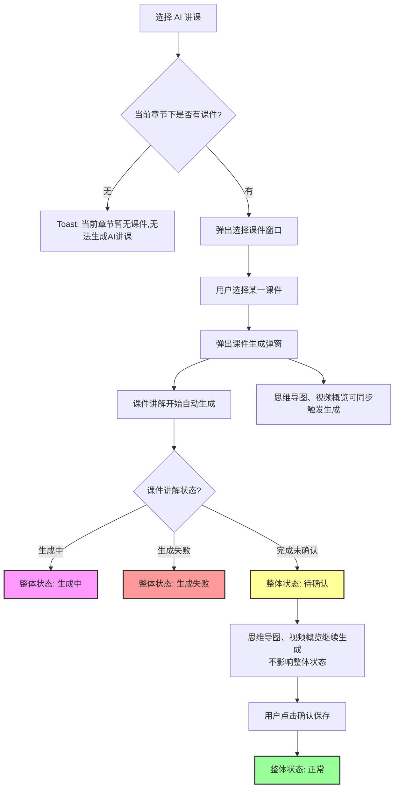
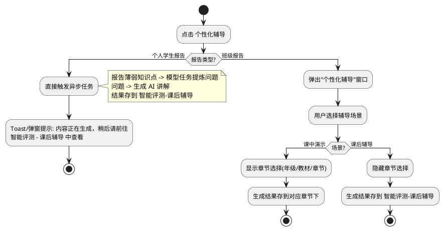

# 个性化备课及辅导 需求文档

## 一、需求概述

将原 AI 专区下的"AI 讲课""AI 讲题"入口下线，其能力并入备课中，并打通基于学情报告的"个性化备课"与"个性化辅导"两条链路，覆盖教师备课、辅导两类场景。

## 二、范围调整

| 调整项           | 调整前               | 调整后                              |
| ------------- | ----------------- | -------------------------------- |
| AI 专区 - AI 讲课 | 独立入口              | 入口下线，能力并入智能备课/学情报告               |
| AI 专区 - AI 讲题 | 独立入口              | 入口下线，能力并入智能备课/学情报告               |
| 智能备课 - 备课工具   | 教案、学案、课件、活动等...   | 新增"智能辅导"下拉，含 AI 讲解、AI 讲课 两个新的功能。 |
| 智能备课 - 资源列表   | 教案、课件、活动、听写等...   | 新增 AI 讲解、AI 讲课 两类卡片              |
| 一键生成内容        | 教案、学案、课件、活动等...   | 新增 AI 讲解 可选项                     |
| 校本资源          | 教案、学案、课件、活动等...   | 新增 AI 讲课、AI 讲解 两类及筛选标签           |
| 学情诊断报告（个人/班级） | 个性化教案、个性化学案、个性化课件 | 新增"个性化备课"替换原有功能。新增“个性化辅导”拓展辅导场景。 |
| 智能评测 - 课后辅导   | 无                 | 新增"课后辅导"菜单页，展示用于课后辅导的AI讲解。       |
| 智能授课          | AI活动、智能体、模板活动等... | 新增 AI 讲解、AI 讲课。                  |

## 三、详细功能

### 3.1 智能备课 — 智能辅导入口

在"智能备课"页面，备课工具栏新增 **智能辅导** 下拉菜单，包含两个子项：**AI 讲解**、**AI 讲课**。

#### 3.1.1 AI 讲解

点击后弹出"AI 讲解"弹窗，功能与原 AI 专区"AI 讲题"一致，区别仅在于由页面改造为弹窗：

- 用户输入问题或知识点（可上传图片）
- 点击"生成讲解"后弹出生成窗口，展示生成过程
- 生成完成后自动切换为预览界面。

**状态规则：**

| 阶段       | 状态  | 右上角按钮 |
| -------- | --- | ----- |
| 初始生成完成   | 草稿  | 确认保存  |
| 用户点击确认保存 | 正常  | 分享    |

#### 3.1.2 AI 讲课

点击后逻辑如下：

- **课件讲解**：自动生成，其生成状态决定整体状态。
- **思维导图、视频概览**：课件讲解开始生成后即可同步触发生成，与课件讲解并发进行；但其生成状态不影响整体状态

**整体状态规则（以课件讲解为准）：**

| 课件讲解状态   | 整体状态 | 右上角按钮 |
| -------- | ---- | ----- |
| 生成中      | 生成中  | 无     |
| 生成失败     | 生成失败 | 无     |
| 完成（未确认）  | 待确认  | 确认保存  |
| 用户点击确认保存 | 正常   | 分享    |

> 思维导图、视频概览的生成不影响整体状态，仅作为附加内容展示。

### 3.2 智能备课 — 资源列表卡片

资源列表新增两类卡片：**AI 讲课**、**AI 讲解**。

| 卡片操作 | 是否所有状态可用 | 说明               |
| ---- | -------- | ---------------- |
| 共享   | 仅"正常"状态  | 共享至校本资源库，对同校老师可见 |
| 删除   | 是        | 删除卡片             |
| 打开预览 | 是        | 点击卡片打开对应预览弹窗     |

> 共享规则：与现有共享一致，共享到校本资源库后，同校教师可在"校本资源"中查看/拷贝。

### 3.3 智能备课 — 校本资源

- "校本资源"弹窗中新增 **AI 讲课、AI 讲解** 两种资源类型
- 顶部筛选标签同步新增这两类

### 3.4 智能备课 — 一键生成内容

"一键生成内容"窗口新增 **AI 讲解** 可选项：

- 可与教案、学案、随堂测等任意组合多选
- 选中后，将通过一键备课工作流：先基于教材节点内容生成问题，再基于问题生成讲解
- 生成的 AI 讲解资源归属于对应章节

### 3.5 学情诊断报告 — 个性化备课

在"学情诊断报告"页面新增 **个性化备课** 按钮，点击弹出"个性化备课"窗口。

**窗口字段：**

| 字段      | 说明                |
| ------- | ----------------- |
| 年级      | 必选                |
| 教材版本    | 必选                |
| 章节      | 必选                |
| 备课内容    | 多选，默认勾选 教案、学案、随堂测 |
| 各内容点数   | 随选项动态显示           |
| 预计消耗总点数 | = 各内容点数之和         |

> 各项点数与"智能备课 - 一键生成内容"中读取同一份配置，无需另行定义。
> 备课内容类型需要根据报告所属学科显示所对应的：
>   数学：教案、学案、模板活动、AI活动、抽奖活动、智能体、随堂测
>   语文：教案、学案、模板活动、AI活动、抽奖活动、智能体、听写、随堂测
>   英语：教案、学案、模板活动、AI活动、抽奖活动、智能体、听写、随堂测、单词评测、对话评测、场景对话

**提交逻辑：**

- 校验年级/教材/章节必选
- 校验"备课内容"至少勾选一项（多选必选）
- 复用"智能备课 - 一键生成内容"的工作流，并在原有入参基础上新增 **薄弱知识点** 参数（来源：当前学情诊断报告）
- 关闭弹窗，弹出"内容正在生成"提示窗口

**后端/工作流调整说明：**

- 现状：智能备课 - 一键生成内容 的工作流入参不包含"薄弱知识点"
- 本次需求：需在原工作流入参中 **新增"薄弱知识点"参数**（列表型），学情报告调用方必须传入；智能备课 - 一键生成内容 调用时，该参数传空

### 3.6 学情诊断报告 — 个性化辅导

在"学情诊断报告"页面新增 **个性化辅导** 按钮。根据报告类型不同，行为不同：

**场景规则：**

| 场景   | 章节选择  | 生成结果归属      |
| ---- | ----- | ----------- |
| 课中演示 | 显示且必选 | 当前所选章节      |
| 课后辅导 | 隐藏    | 智能评测 - 课后辅导 |

### 3.7 智能评测 — 新增"课后辅导"菜单

新增 **课后辅导** 菜单页（仅教师角色可见），展示"通过学情报告生成的、非课中演示的 AI 讲解"内容。

**卡片字段：**

| 字段   | 说明                               |
| ---- | -------------------------------- |
| 标题   | AI 讲解内容标题                        |
| 日期   | 生成日期                             |
| 适用范围 | 学生姓名（来自个人报告）/ 班级名称（来自班级报告且为课后辅导） |
| 状态   | 生成中 / 生成失败 / 草稿 / 正常 （与智能备课那边相同） |

**预览按钮：**

| 状态   | 右上角按钮          |
| ---- | -------------- |
| 生成中  | 无（等待）          |
| 生成失败 | 重新生成           |
| 草稿   | 确认保存           |
| 正常   | 分享（**仅此状态显示**） |

### 3.8 智能授课

在"智能授课"页面/课件授课界面，新增**AI 讲解**、**AI 讲课** 两内容项（如果备课内容有的话）。