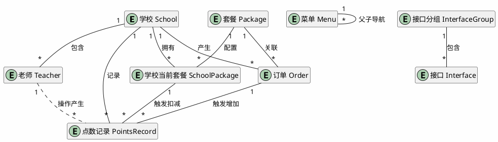
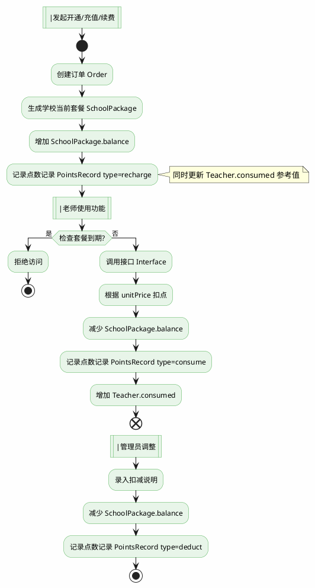
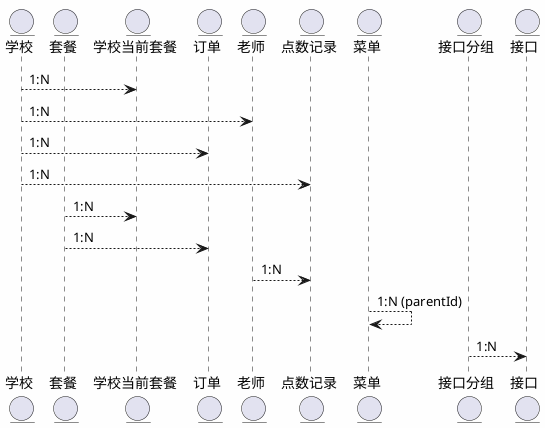

# 套餐权限系统数据结构

## 一、实体关系总览



---

## 二、核心实体说明

### 2.1 学校 (School)

学校是系统的主体，所有业务都围绕学校展开。

| 字段         | 类型     | 说明               |
| ------------ | -------- | ------------------ |
| id           | string   | 主键，学校唯一标识 |
| name         | string   | 学校名称           |
| code         | string   | 学校编码           |
| contact      | string   | 联系人姓名         |
| contactPhone | string   | 联系人电话         |
| account      | string   | 登录账号           |
| disabled     | boolean  | 是否禁用           |
| createdAt    | datetime | 创建时间           |

---

### 2.2 套餐 (Package)

套餐是商品配置，相当于"角色"，定义了功能权限和初始资源。

| 字段            | 类型     | 说明                                            |
| --------------- | -------- | ----------------------------------------------- |
| id              | string   | 主键                                            |
| name            | string   | 套餐名称，如"年度旗舰版"                        |
| type            | enum     | 类型：`billing` 计费套餐 / `trial` 试用套餐 |
| price           | decimal  | 价格（元）                                      |
| durationDays    | int      | 有效期（天）                                    |
| initialPoints   | int      | 初始点数                                        |
| teacherLimit    | int      | 教师账号上限，null 表示不限制                   |
| modules         | json     | 功能模块配置                                    |
| interfaceTrials | json     | 接口试用次数配置                                |
| status          | boolean  | 是否启用                                        |
| createdAt       | datetime | 创建时间                                        |

**modules 字段示例：**

```json
[
  {
    "cat": "jiaan",
    "subs": [
      { "id": "jiaan_ai", "count": 0 },
      { "id": "jiaan_manual", "count": 0 }
    ]
  },
  {
    "cat": "prepare",
    "subs": [
      { "id": "prepare_lesson", "count": 0 },
      { "id": "prepare_courseware", "count": 50 }
    ]
  }
]
```

**interfaceTrials 字段示例：**

```json
[
  { "id": 1, "count": 10 },
  { "id": 2, "count": 5 }
]
```

---

### 2.3 学校当前套餐 (SchoolPackage)

记录学校当前生效的套餐以及剩余点数。

| 字段      | 类型     | 说明                           |
| --------- | -------- | ------------------------------ |
| id        | string   | 主键                           |
| schoolId  | string   | 所属学校 FK                    |
| packageId | string   | 套餐 ID FK                     |
| balance   | int      | 当前可用点数                   |
| startDate | date     | 生效日期                       |
| endDate   | date     | 到期日期                       |
| status    | enum     | 状态：active/expired/cancelled |
| createdAt | datetime | 创建时间                       |

---

### 2.4 订单 (Order)

记录每一笔交易。

| 字段      | 类型     | 说明                                                      |
| --------- | -------- | --------------------------------------------------------- |
| id        | string   | 主键，订单号                                              |
| type      | enum     | 类型：trial 试用 / open 开通 / recharge 充值 / renew 续费 |
| schoolId  | string   | 学校 ID FK                                                |
| packageId | string   | 套餐 ID FK                                                |
| points    | int      | 点数                                                      |
| amount    | decimal  | 金额（元）                                                |
| startDate | date     | 生效日期                                                  |
| endDate   | date     | 到期日期                                                  |
| createdAt | datetime | 创建时间                                                  |

---

### 2.5 老师 (Teacher)

学校下的教师账号。

| 字段      | 类型     | 说明                       |
| --------- | -------- | -------------------------- |
| id        | string   | 主键                       |
| schoolId  | string   | 所属学校 FK                |
| name      | string   | 姓名                       |
| account   | string   | 登录账号                   |
| phone     | string   | 手机号                     |
| subjects  | json     | 任教科目                   |
| maxPoints | int      | 点数额度上限，0 表示无限制 |
| consumed  | int      | 已消耗点数                 |
| disabled  | boolean  | 是否禁用                   |
| createdAt | datetime | 创建时间                   |

**subjects 字段示例：**

```json
[
  { "name": "语文", "isMain": true },
  { "name": "数学", "isMain": false }
]
```

---

### 2.6 点数记录 (PointsRecord)

学校的点数流水账，记录每一笔增减。

| 字段         | 类型     | 说明                                             |
| ------------ | -------- | ------------------------------------------------ |
| id           | string   | 主键                                             |
| schoolId     | string   | 学校 ID FK                                       |
| teacherId    | string   | 教师 ID FK（消费时记录）                         |
| type         | enum     | 类型：recharge 充值 / consume 消费 / deduct 扣减 |
| points       | int      | 点数变化（正数为增加，负数为减少）               |
| balance      | int      | 操作后余额                                       |
| source       | string   | 来源，如"智能备课"、"管理员调整"                 |
| resourceName | string   | 具体资源名称                                     |
| relatedId    | string   | 关联业务 ID（如订单号、资源ID）                  |
| operator     | string   | 操作人                                           |
| createdAt    | datetime | 操作时间                                         |
| remark       | string   | 备注                                             |

---

## 三、配置实体说明

### 3.1 菜单 (Menu)

系统功能菜单，通过 parentId 实现父子导航。

| 字段     | 类型    | 说明                    |
| -------- | ------- | ----------------------- |
| id       | int     | 主键                    |
| name     | string  | 菜单名称                |
| parentId | int     | 父级 ID，0 表示顶级菜单 |
| code     | string  | 菜单编码                |
| path     | string  | 路由路径                |
| icon     | string  | 图标                    |
| sort     | int     | 排序                    |
| status   | boolean | 是否启用                |

---

### 3.2 接口分组 (InterfaceGroup)

接口的分类分组。

| 字段   | 类型    | 说明                   |
| ------ | ------- | ---------------------- |
| id     | int     | 主键                   |
| name   | string  | 分组名称，如"智能备课" |
| sort   | int     | 排序                   |
| status | boolean | 是否启用               |

---

### 3.3 接口 (Interface)

接口的定义，用于调用时扣点。

| 字段      | 类型    | 说明                     |
| --------- | ------- | ------------------------ |
| id        | int     | 主键                     |
| groupId   | int     | 所属分组 FK              |
| name      | string  | 接口名称，如"AI生成教案" |
| path      | string  | 接口路径                 |
| method    | string  | 请求方法 GET/POST        |
| unitPrice | int     | 每次消耗点数             |
| status    | boolean | 是否启用                 |

---

## 四、数据流转示意



---

## 五、ER 图（简化版）


