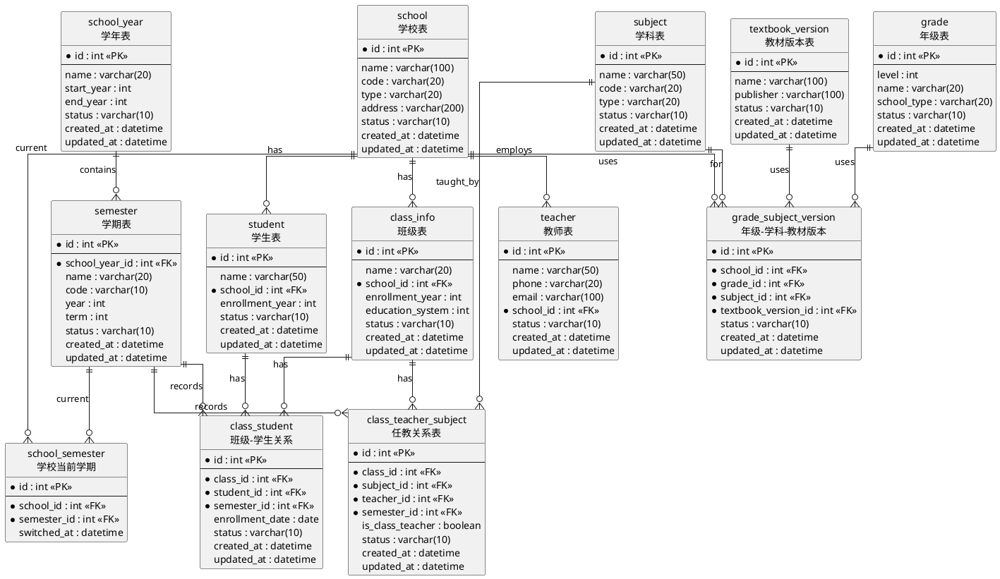

# 数据结构

## ER 图

```plantuml
@startuml
hide circle
skinparam linetype ortho

entity "school\n学校表" as sc {
    * id : int <<PK>>
    --
    name : varchar(100)
    code : varchar(20)
    type : varchar(20)
    address : varchar(200)
    status : varchar(10)
    created_at : datetime
    updated_at : datetime
}

entity "school_year\n学年表" as sy {
    * id : int <<PK>>
    --
    name : varchar(20)
    start_year : int
    end_year : int
    status : varchar(10)
    created_at : datetime
    updated_at : datetime
}

entity "semester\n学期表" as sem {
    * id : int <<PK>>
    --
    * school_year_id : int <<FK>>
    name : varchar(20)
    code : varchar(10)
    year : int
    term : int
    status : varchar(10)
    created_at : datetime
    updated_at : datetime
}

entity "school_semester\n学校当前学期" as ssm {
    * id : int <<PK>>
    --
    * school_id : int <<FK>>
    * semester_id : int <<FK>>
    switched_at : datetime
}

entity "teacher\n教师表" as th {
    * id : int <<PK>>
    --
    name : varchar(50)
    phone : varchar(20)
    email : varchar(100)
    * school_id : int <<FK>>
    status : varchar(10)
    created_at : datetime
    updated_at : datetime
}

entity "class_info\n班级表" as ci {
    * id : int <<PK>>
    --
    name : varchar(20)
    * school_id : int <<FK>>
    enrollment_year : int
    education_system : int
    status : varchar(10)
    created_at : datetime
    updated_at : datetime
}

entity "student\n学生表" as stu {
    * id : int <<PK>>
    --
    name : varchar(50)
    * school_id : int <<FK>>
    enrollment_year : int
    status : varchar(10)
    created_at : datetime
    updated_at : datetime
}

entity "class_student\n班级-学生关系" as cs {
    * id : int <<PK>>
    --
    * class_id : int <<FK>>
    * student_id : int <<FK>>
    * semester_id : int <<FK>>
    enrollment_date : date
    status : varchar(10)
    created_at : datetime
    updated_at : datetime
}

entity "class_teacher_subject\n任教关系表" as ctc {
    * id : int <<PK>>
    --
    * class_id : int <<FK>>
    * subject_id : int <<FK>>
    * teacher_id : int <<FK>>
    * semester_id : int <<FK>>
    is_class_teacher : boolean
    status : varchar(10)
    created_at : datetime
    updated_at : datetime
}

entity "subject\n学科表" as sub {
    * id : int <<PK>>
    --
    name : varchar(50)
    code : varchar(20)
    type : varchar(20)
    status : varchar(10)
    created_at : datetime
    updated_at : datetime
}

entity "textbook_version\n教材版本表" as tv {
    * id : int <<PK>>
    --
    name : varchar(100)
    publisher : varchar(100)
    status : varchar(10)
    created_at : datetime
    updated_at : datetime
}

entity "grade\n年级表" as gr {
    * id : int <<PK>>
    --
    level : int
    name : varchar(20)
    school_type : varchar(20)
    status : varchar(10)
    created_at : datetime
    updated_at : datetime
}

entity "grade_subject_version\n年级-学科-教材版本" as gsv {
    * id : int <<PK>>
    --
    * school_id : int <<FK>>
    * grade_id : int <<FK>>
    * subject_id : int <<FK>>
    * textbook_version_id : int <<FK>>
    status : varchar(10)
    created_at : datetime
    updated_at : datetime
}

sc ||--o{ th : employs
sc ||--o{ ci : has
sc ||--o{ stu : has
sc ||--o{ ssm : current
sc ||--o{ gsv : uses
sy ||--o{ sem : contains
sem ||--o{ ssm : current
ci ||--o{ cs : has
stu ||--o{ cs : has
ci ||--o{ ctc : has
sub ||--o{ ctc : taught_by
sem ||--o{ cs : records
sem ||--o{ ctc : records
gr ||--o{ gsv : uses
sub ||--o{ gsv : for
tv ||--o{ gsv : uses

@enduml
```
