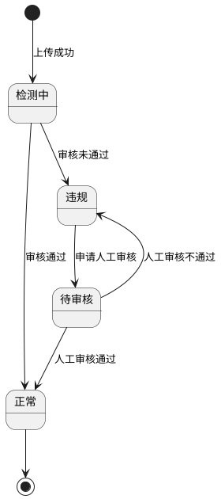

# 教师端 - 智能授课

## 0. 文档修订记录

| 版本号 | 修改日期 | 修改人 | 修改内容                                           | 备注 |
| :----- | :------- | :----- | :------------------------------------------------- | :--- |
| V5.0   | -        | -      | 新增教案、课件、学案本地上传功能及内容安全审核流程 | -    |
| V5.0   | -        | -      | -                                                  | -    |

---

## 1. 智能备课页面

### 1.1 布局结构

页面采用左右分栏布局：

- **左侧**：教材目录树（章/节两级结构），仅最后一级（节次）可点击选择
- **右侧**：选中节次后显示该节次的备课内容卡片

### 1.2 目录结构

- 章节目录可展开/折叠，同时只展开一个章节
- 节次可点击选中，选中后高亮显示
- 选中节次后，右侧内容区加载该节次的备课内容

### 1.3 内容卡片

#### 排列规则

- 不分页，全部加载
- 按创建时间降序排列（最新在前）

#### 卡片元素

- **Icon**：根据内容类型显示对应图标
- **标题**：内容名称
- **类型标签**：统一显示内容类型
- **创建日期**：格式为"X月X日"
- **来源标签**（特定类型）：
  - **本地上传**：教案、课件、学案从本地上传时显示
  - **官方**：智能体为官方提供时显示

#### 卡片状态（仅限本地上传内容）

> 以下卡片状态规则仅适用于本地上传的教案、课件、学案。其他类型卡片的状态和之前一致，不适用此规则。

| 状态   | 显示方式         | 说明                                         |
| :----- | :--------------- | :------------------------------------------- |
| 正常   | 不显示状态标签   | 内容安全审核通过，可正常使用                 |
| 检测中 | 黄色标签"检测中" | 内容正在安全审核中                           |
| 违规   | 红色标签"违规"   | 内容安全审核未通过，不可使用，可申请人工审核 |
| 待审核 | 橙色标签"待审核" | 已申请人工审核，等待运营处理                 |

#### 卡片菜单操作（仅限本地上传内容）

> 以下菜单操作规则仅适用于本地上传的教案、课件、学案。

| 状态   | 可用操作                   | 禁用操作   |
| :----- | :------------------------- | :--------- |
| 正常   | 重命名、下载、共享、删除   | -          |
| 检测中 | 重命名、删除               | 下载、共享 |
| 违规   | 重命名、申请人工审核、删除 | 下载、共享 |
| 待审核 | 重命名、删除               | 下载、共享 |

---

## 2. 本地上传功能

> 本章节为新增功能，描述教案、课件、学案的本地文件上传需求。

### 2.1 上传入口

在工具栏中，点击"添加教案/课件/学案"按钮旁的下拉箭头，可选择"上传教案/课件/学案"选项打开上传弹窗。

### 2.2 支持的文件格式与大小

| 内容类型 | 支持格式                       | 文件大小限制       |
| :------- | :----------------------------- | :----------------- |
| 教案     | doc、docx、pdf、ppt、pptx、txt | 单文件不超过 50MB  |
| 课件     | ppt、pptx                      | 单文件不超过 300MB |
| 学案     | doc、docx、pdf、ppt、pptx、txt | 单文件不超过 50MB  |

### 2.3 上传流程

#### 2.3.1 文件选择

1. 用户点击"选择文件"按钮，打开系统文件选择器
2. 根据内容类型，过滤显示支持的文件格式
3. 用户选择文件后，自动进入上传流程

#### 2.3.2 文件校验

| 场景           | 提示语           | 处理方式             |
| :------------- | :--------------- | :------------------- |
| 文件格式不支持 | 不支持的文件格式 | Toast 提示，终止上传 |
| 文件大小超限   | 文件大小超过限制 | Toast 提示，终止上传 |

#### 2.3.3 上传进度

1. 显示上传进度弹窗
2. 实时显示上传文件名和百分比进度
3. 支持取消上传操作
4. 上传完成后自动关闭进度弹窗

### 2.4 内容安全审核流程

#### 2.4.1 自动审核机制

上传成功后，文件自动上传至 COS（对象存储），COS 会自动进行内容安全审核（需在对象存储控制台开启自动审核服务）。

后端通过定时轮询 COS 接口查询审核结果，获取结果后更新数据状态。

#### 2.4.2 审核状态流转

### 2.5 待审核状态处理

#### 2.5.1 申请人工审核

当内容状态为"违规"时，用户可点击菜单中的"申请人工审核"按钮提交人工审核申请。

| 场景             | 提示语                     | 说明                         |
| :--------------- | :------------------------- | :--------------------------- |
| 提交人工审核成功 | 已提交人工审核，请耐心等待 | Toast 提示，状态变为"待审核" |

提交后，菜单中的"申请人工审核"按钮消失。

#### 2.5.2 运营后台处理

运营后台显示该条数据状态为"待审核"，运营人员可进行以下操作：

| 操作   | 结果           | 说明                   |
| :----- | :------------- | :--------------------- |
| 通过   | 状态变为"正常" | 内容恢复正常使用       |
| 不通过 | 状态变为"违规" | 用户可再次申请人工审核 |

### 2.6 页面轮询机制

#### 轮询触发条件

当页面存在"检测中"状态的内容时，自动启动轮询机制。

#### 轮询规则

| 参数     | 值           | 说明                         |
| :------- | :----------- | :--------------------------- |
| 轮询间隔 | 10 秒        | 每 10 秒轮询一次后端状态     |
| 停止条件 | 获得审核结果 | 无论审核通过或失败，停止轮询 |

#### 轮询结果处理

| 审核结果 | 状态更新         | 提示语             | 后置条件                |
| :------- | :--------------- | :----------------- | :---------------------- |
| 审核通过 | 移除"检测中"标签 | 内容安全检测通过   | 停止轮询。启用下载/共享 |
| 审核失败 | 显示"违规"标签   | 内容安全检测未通过 | 停止轮询                |

---

## 3. 本地文件预览

> 本地上传的文件预览采用文件预览插件。

### 3.1 预览方式

点击本地上传的教案、课件、学案卡片，进入预览模式。

### 3.2 预览实现

| 文件类型 | 预览方式         | 说明                         |
| :------- | :--------------- | :--------------------------- |
| PPT/PPTX | Office 预览插件  | 使用浏览器插件或在线预览服务 |
| Word     | 文档预览插件     | 使用浏览器插件或在线预览服务 |
| PDF      | PDF 预览插件     | 使用浏览器插件或在线预览服务 |
| TXT      | 直接显示文本内容 | -                            |

---
