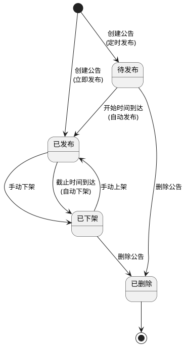
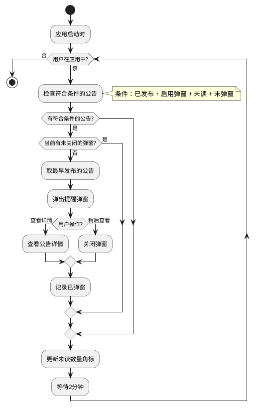
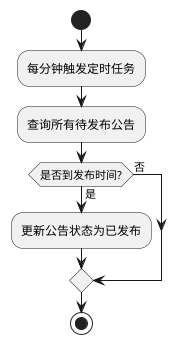
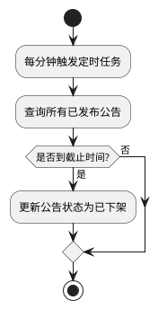
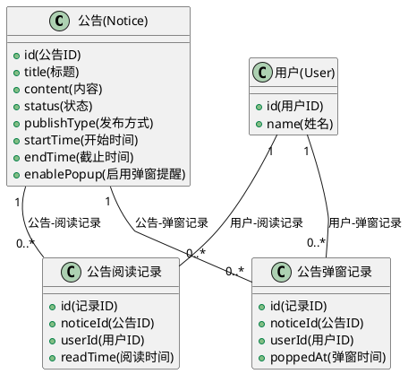

# [公告功能] 产品需求文档

## 0. 文档修订记录

| 版本号 | 修改日期   | 修改人 | 修改内容     | 备注                       |
| :----- | :--------- | :----- | :----------- | :------------------------- |
| V4.0   | 2026-01-04 | -      | 初始版本创建 | 基于需求确认及业务需求梳理 |

---

## 1. 项目背景与目标

### 1.1 背景

系统新功能上线、版本更新、系统维护等事项需要及时传达给教师端用户。当前没有公告功能，如果项目上线或功能变更，需要通过其他方式通知到学校，操作繁琐且效率低下。

### 1.2 目标

* 实现运营平台向教师端推送公告的功能，系统上线、功能变更能够提前告知用户。
* 实现公告的发布管理，支持定时发布、有效期管理。
* 实现公告的阅读状态管理，通过阅读统计了解公告传达效果。

### 1.3 范围

* **包含：**
  * **运营平台端**：公告的创建、编辑、删除、发布、下架管理，阅读统计。
  * **教师端**：公告列表查看、详情查看、阅读状态管理。
* **不包含：** 公告模板、附件上传、消息推送（短信/邮件）、公告反馈/评论功能。

---

## 2. 全局规约

### 2.1 权限说明

| 角色                 | 权限范围                                                                                         |
| :------------------- | :----------------------------------------------------------------------------------------------- |
| **运营人员**   | 运营平台所有用户均可创建、编辑、删除、发布、下架公告，无权限限制（当前版本未实现权限管理功能）。 |
| **教师端用户** | 所有用户均可查看（公告板模式），已读记录为每个用户独立管理。新用户可以看到历史公告。             |

---

## 3. 业务模型图

### 3.1 公告状态图

### 3.2 弹窗提醒与未读数量更新机制活动图

### 3.3 定时发布流程活动图

### 3.4 自动下架流程活动图

### 3.5 数据关系图

---

## 4. 功能需求详细说明

### 4.1 运营平台端

> **定位**：公告的创建、编辑、发布、管理功能。

#### 4.1.1 公告创建

> 创建新公告，设置公告属性。

* **入口**：公告管理页面，点击"新建公告"按钮。

| 字段名称 | 类型           | 必填     | 限制/规则                                |
| :------- | :------------- | :------- | :--------------------------------------- |
| 标题     | 输入框         | 是       | 最多 30 字                               |
| 内容     | 文本域         | 是       | 最多 1000 字，实时显示剩余字数           |
| 弹窗提醒 | 复选框         | 否       | 启用后，公告会以弹窗形式在教师端弹出提醒 |
| 发布方式 | 单选按钮       | 是       | 立即发布（默认）/ 定时发布               |
| 开始时间 | 日期时间选择器 | 条件必填 | 定时发布时显示，不能早于当前时间         |
| 截止时间 | 日期时间选择器 | 是       | 必须晚于开始时间或当前时间               |

**操作反馈**

| 操作     | 场景                             | 提示语                         |
| :------- | :------------------------------- | :----------------------------- |
| 创建公告 | 标题为空                         | 请输入公告标题                 |
| 创建公告 | 内容为空                         | 请输入公告内容                 |
| 创建公告 | 截止时间为空                     | 请选择截止时间                 |
| 创建公告 | 定时发布但未设置开始时间         | 请选择开始时间                 |
| 创建公告 | 开始时间早于当前时间             | 开始时间不能早于当前时间       |
| 创建公告 | 截止时间早于当前时间（立即发布） | 截止时间必须晚于当前时间       |
| 创建公告 | 截止时间早于开始时间（定时发布） | 截止时间必须晚于开始时间       |
| 创建公告 | 创建成功（立即发布）             | 公告发布成功                   |
| 创建公告 | 创建成功（定时发布）             | 公告创建成功，将在指定时间发布 |

#### 4.1.2 公告列表

> 公告列表展示、状态查看、操作入口。

* **列表字段**：序号、标题、公告内容、弹窗提醒、状态、有效期、创建时间、创建人、已读人数、操作。
* **排序规则**：按创建时间降序排列（最新创建的显示在最上面）。
* **分页**：每页显示 10 条记录。

| 字段名称 | 说明                                                              |
| :------- | :---------------------------------------------------------------- |
| 序号     | 当前页的行号                                                      |
| 标题     | 公告标题                                                          |
| 公告内容 | 公告内容最多显示 3 行，超出部分用省略号表示，鼠标悬浮显示完整内容 |
| 弹窗提醒 | 已启用 / 未启用                                                   |
| 状态     | 待发布 / 已发布 / 已下架                                          |
| 有效期   | 开始时间和截止时间                                                |
| 创建时间 | 公告创建的时间                                                    |
| 创建人   | 创建公告的用户                                                    |
| 已读人数 | 已阅读该公告的用户人数                                            |
| 操作     | 编辑、下架/上架、删除                                             |

**操作规则**：

| 状态   | 可用操作         |
| :----- | :--------------- |
| 待发布 | 编辑、删除       |
| 已发布 | 编辑、下架       |
| 已下架 | 编辑、上架、删除 |

#### 4.1.3 公告编辑

> 编辑已创建的公告。根据公告状态，可编辑的字段不同。

* **待发布状态**：
  * 可以编辑所有字段（标题、内容、弹窗提醒、发布方式、开始时间、截止时间）。
* **已发布状态**：
  * 只能编辑标题、内容、弹窗提醒。
  * 不能编辑发布方式、开始时间、截止时间。
  * 编辑保存后，教师端立即看到更新后的内容。
* **已下架状态**：
  * 只能编辑标题、内容、弹窗提醒。
  * 不能编辑发布方式、开始时间、截止时间。

**操作反馈**

* **表单验证**：同新建公告的验证规则（见 4.1.1 操作反馈）。
* **保存成功**：显示"公告更新成功"提示。

#### 4.1.4 公告下架与上架

> 手动下架公告，或重新上架已下架的公告。

* **手动下架**：
  * 已发布状态的公告可以手动下架。
  * 下架后，状态变为"已下架"，教师端不再显示。
* **上架操作**：
  * 已下架状态的公告可以重新上架。
  * 上架后，状态变为"已发布"，教师端重新显示。
* **自动下架**：
  * 当公告的截止时间到达时，系统自动将公告状态改为"已下架"。
  * 教师端不再显示该公告。

**操作反馈**

| 场景     | 提示语   | 形式  |
| :------- | :------- | :---- |
| 下架成功 | 下架成功 | Toast |
| 上架成功 | 上架成功 | Toast |

#### 4.1.5 公告删除

> 删除公告，彻底清除公告数据。

* **删除规则**：
  * 待发布、已下架状态的公告可以删除。
  * 已发布状态的公告不能删除，需要先下架再删除。
  * 删除后，公告数据彻底清除，不可恢复。
  * 删除公告时，同时删除该公告的所有阅读记录。
* **删除确认**：删除操作需要二次确认。

**操作反馈**

| 场景     | 提示语                                 | 形式     |
| :------- | :------------------------------------- | :------- |
| 删除确认 | 确定要删除这个公告吗？删除后不可恢复。 | 弹窗确认 |
| 删除成功 | 删除成功                               | Toast    |

---

### 4.2 教师端

> **定位**：公告的查看、阅读状态管理功能。

#### 4.2.1 公告列表

> 公告列表展示、阅读状态查看、操作入口。

* **入口**：
  * 导航栏右侧公告图标，显示未读数量角标。1~99显示具体数字，超过99显示99+。
  * 角标更新：应用启动时获取一次，之后每 2 分钟自动更新一次。
  * 点击打开右侧抽屉式面板。
* **列表展示**：
  * 在右侧抽屉中展示，宽度固定。
  * 每页显示 10 条记录。
  * 按发布时间（开始时间）降序排列，最新发布的在最上面。
* **列表字段**：
  * 标题、内容预览、发布时间、已读/未读状态。

| 字段名称      | 说明                                   |
| :------------ | :------------------------------------- |
| 标题          | 公告标题                               |
| 内容预览      | 公告内容的前几行，超出部分用省略号表示 |
| 发布时间      | 公告的发布时间（开始时间）             |
| 已读/未读状态 | 未读：红色圆点；已读：无圆点           |

* **操作栏**：
  * 提供"全部已读"按钮，点击后将所有未读公告标记为已读。
  * 当没有公告时，按钮禁用。
* **分页**：
  * 显示总公告数、每页条数、上一页/下一页按钮。
  * 支持页码导航。
* **空状态**：
  * 当没有公告时，显示"暂无公告"缺省文案。
  * 此时"全部已读"按钮禁用。

#### 4.2.2 公告详情

> 查看公告完整内容。

* **入口**：
  * 从公告列表点击公告卡片进入。
  * 从弹窗提醒点击"查看详情"进入。
* **详情展示**：
  * 以弹窗形式展示，宽度固定。
  * 显示内容：标题、发布时间、完整内容。
  * 标题：大号加粗显示。
  * 发布时间：弱化显示（灰色、小号字体）。
  * 内容：纯文本格式，保留换行符。
* **已读标记**：
  * 进入详情页时，自动标记为已读（无论从公告列表还是弹窗提醒进入）。
  * 列表中的红色圆点消失。
* **关闭**：
  * 点击右上角关闭按钮关闭弹窗。
  * 点击背景遮罩关闭弹窗。

**极端情况处理**：

| 操作     | 入口     | 场景     | 处理方式       | 提示语                 | 形式  |
| :------- | :------- | :------- | :------------- | :--------------------- | :---- |
| 打开详情 | 公告列表 | 已被删除 | 返回列表，刷新 | 该公告已被删除         | Toast |
| 打开详情 | 公告列表 | 已被下架 | 返回列表，刷新 | 该公告已下架，无法查看 | Toast |
| 打开详情 | 弹窗提醒 | 已被删除 | 关闭弹窗       | 该公告已被删除         | Toast |
| 打开详情 | 弹窗提醒 | 已被下架 | 关闭弹窗       | 该公告已下架，无法查看 | Toast |

#### 4.2.3 阅读状态管理

> 标记公告为已读状态。

* **已读标记方式**：
  * 进入公告详情页时，自动标记为已读。
  * 点击"全部已读"按钮，将所有未读公告一键标记为已读。
* **已读状态显示**：
  * 未读公告：列表中显示红色圆点。
  * 已读公告：列表中无圆点。
* **已读记录**：
  * 每个教师的已读记录独立管理。

**操作反馈**

| 操作         | 场景         | 提示语           | 形式  |
| :----------- | :----------- | :--------------- | :---- |
| 全部标记已读 | 有未读公告   | 已全部标记为已读 | Toast |
| 全部标记已读 | 没有未读公告 | 没有未读公告     | Toast |

#### 4.2.4 弹窗提醒

> 启用了弹窗提醒的公告会在教师进入系统时弹出提醒。

* **触发条件**：
  * 应用启动时，首次检查。
  * 之后每 2 分钟检查一次。
  * 每次检查同时进行：
    * 检查是否有符合条件的公告（已发布 + 启用弹窗 + 未读 + 未弹窗）。
    * 获取未读公告总数，更新导航栏未读数量角标。
* **弹窗内容**：
  * 显示公告的标题和内容预览（100字）。
  * 提供"查看详情"和"稍后查看"按钮。
* **交互规则**：
  * 点击"查看详情"：进入公告详情页，标记为已读，记录已弹窗，关闭弹窗。
  * 点击"稍后查看"：关闭弹窗，不标记为已读，但**记录已弹窗**。
* **弹窗顺序**：
  * 每次检查只弹出**最早发布的**符合条件的公告（按发布时间排序）。
  * 如果当前有未关闭的弹窗，则不弹出新窗口，继续等待。
  * 保证同一时刻只有一个弹窗弹出，按时间顺序逐个提醒。
* **弹窗频率**：
  * 每个启用弹窗提醒的公告只弹窗一次（已弹窗过的不再弹窗）。
  * 标记为已读后不再弹窗。

## 5. 非功能需求

### 5.1 性能要求

> 暂无，后续按需补充。

### 5.2 数据埋点

> 暂无，后续按需补充。
